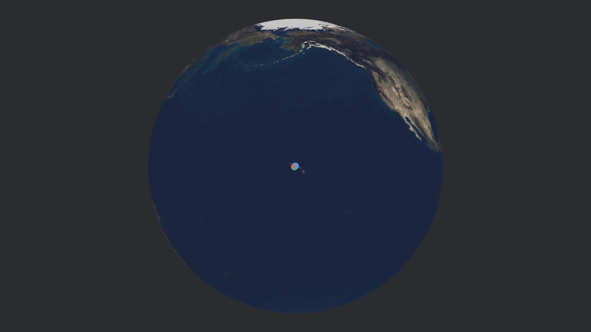
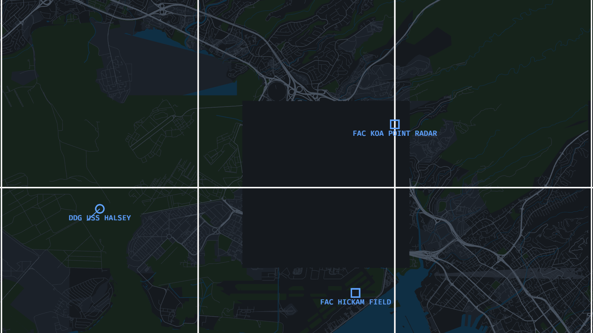
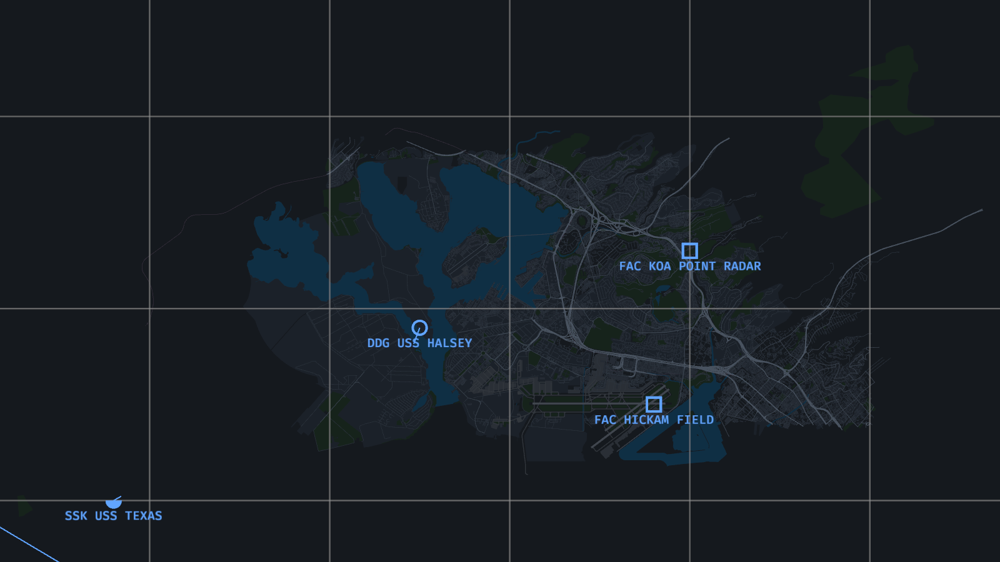
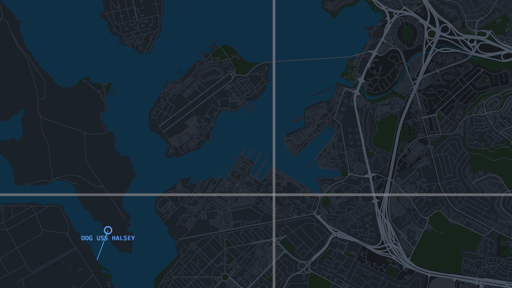

# MiaoSuan Decision Optimization System（妙算决策优化系统）

仿 [CMO（Command: Modern Operations）](https://www.matrixgames.com/game/command-modern-operations) 的海空战术态势/决策推演原型，使用 [Bevy](https://bevyengine.org) 渲染 [OpenStreetMap](https://www.openstreetmap.org) 矢量地图。内置“珍珠港守望”想定：蓝方守备珍珠港，红方水面群自西南接近、潜艇渗透，中立商船过境。

应用从**地球（全球态势）**起步：拖拽旋转地球、滚轮向地表推进，越过阈值即按“视角连续性”无缝落入 **实时 OSM 战术地图**——瓦片按需从 Overpass API 在线拉取，落入地球上任何地点都能加载当地地图；在地图上向外缩放到极限则自动升轨回到地球。






> 截图由 `--render-image` 离屏渲染生成，只包含世界层（地图/单位/标签）。HUD 面板在窗口交互模式下呈现，详见[已知限制](#已知限制)。

## 功能

| 领域 | 能力 |
| --- | --- |
| 地球 | 球面贴图瓦片流（NASA GIBS Blue Marble 着色地形，z0-8 按视距分级、半球剔除、LRU 120 张、桌面磁盘缓存）+ 内嵌底图球兜底；单位以战略标记同步到球面（遵循战争迷雾），OSM 数据区以黄色点环标示 |
| 地球↔地图 | 视角连续性切换：地表视距 ↔ 米/像素 可逆换算，地球推进越过阈值直接落入地图（保持缩放手感连续），地图缩放到极限自动升轨；`G` 键随时互切 |
| 实时地图 | **OpenFreeMap 矢量瓦片**（OpenMapTiles schema 的 MVT，免费无 key、CORS 全开）：Web Mercator XYZ 瓦片按需下载，zoom 随视野米/像素自动加深（z6–z14）；URL 模板启动时从 TileJSON 动态获取（build 路径滚动更新）；手写 protobuf/MVT 解码器，图层映射复用桌面渲染管线；LRU 淘汰视口外瓦片并回收资产 |
| 瓦片缓存 | 三级缓存：内存（本次会话，LRU 24 块）→ **磁盘**（`~/.cache/ms-dos/tiles/`，30 天 TTL，超 1 GiB 自动清理，仅桌面端）→ 网络；重启或 LRU 淘汰后再回该区域直接读盘 |
| 地图 | 解析 OSM XML（`<node>/<way>/<relation>`，含 multipolygon 环拼装与洞归属），按水域/绿地/用地/建筑/道路/铁路/跑道分层三角化，暗色战术主题，0.05° 经纬网 |
| 视角 | 滚轮缩放（锚定光标）、WASD/方向键/左键拖拽/中键拖拽平移，符号与标签屏幕像素恒定 |
| 仿真 | 平台类型（驱逐舰/护卫舰/潜艇/巡逻机/战斗机/设施/商船）、航路点巡逻（转向率限制、循环/单程）、场景时钟与 1×–600× 倍速 |
| 探测 | 雷达（空+面）/声纳（潜+面）/目视（空+面）分类探测；距离过半视为“已分类”（UNKNOWN → 显示型号）；战争迷雾：未被蓝方探测到的红方单位不可见、不可选 |
| 符号 | **MIL-STD-2525 / APP-6 风格**：友方按领域异形框——空中=拱顶框、水面=圆角矩形、水下=碗底框、地面=矩形（框内象形图标：固定翼剪影/舰船壳线/潜艇弧/雷达弧）；敌方=菱形（含图标）、未分类敌情=黄色四叶形、中立=方菱形+船图标；速度矢量线（1 分钟真实航程） |
| 交互 | 左键选择（含接触）、右键对所选蓝方单位下达机动命令、R 恢复巡逻航线、F 聚焦、Space 暂停、`+/-` 倍速、Esc 取消选择 |
| HUD | 顶栏（场景时间/倍速按钮）、右侧 CONTACTS 接触列表（按距离排序，距离+方位）、左下所选单位面板（位置/速度/航向/传感器/武器/导航状态） |

## 架构

```
src/
├── main.rs          # App 组装、CLI、渲染模式、想定启动、离屏渲染/截图/自动退出
├── mvt.rs           # MVT(protobuf) 解码器 + OpenMapTiles 图层映射
├── tiles.rs         # 实时瓦片流：XYZ 按需下载/TileJSON 模板/zoom 选择/LRU 淘汰
├── globe.rs         # 地球视图：球体网格/轨道控制/战略标记/视角连续性换算/视图状态机
├── geo.rs           # 等距圆柱投影（度↔米）、环面积、点包含、方位角
├── osm.rs           # OSM XML 解析、图层提取、multipolygon 环拼装
├── map_render.rs    # 面要素 earcut 三角化、线要素四边形化、经纬网、暗色色板
├── sim.rs           # 单位模型、航路点运动（纯函数）、探测判定、时钟、想定
├── units_render.rs  # NTDS 符号网格、速度矢量、标签、选择环、传感器圈、航线
├── camera.rs        # CameraRig（米/像素单一状态源）、平移缩放
├── input.rs         # 拾取/下令/拖拽状态机、快捷键、UI 命中区
└── ui.rs            # HUD 构建（固定像素布局）与 4Hz 文本刷新
```

关键设计：

- **世界坐标 = 米**，Web Mercator 全球统一坐标系（与 OSM 瓦片体系一致）；瓦片网格顶点使用瓦片局部坐标 + Transform 平移，规避 f32 全球大坐标的精度问题；`OrthographicProjection.scale` 即“米/像素”，符号恒定屏幕尺寸靠运行时缩放实现。
- **运动与探测是纯函数**（`step_unit` / `detect_with`），Bevy 系统只做胶水；核心逻辑全部有单元测试。
- **静态地图合并为每层一个大 Mesh**；动态小元素（速度矢量/航线）用“单位线段网格 + Transform 缩放”避免逐帧重建资产。
- HUD 按钮与面板用固定/锚定像素布局 + 手动命中测试，不依赖 picking 后端。

## 构建与运行

**Web 版：<https://ms-dos.zool.me>**（备用 <https://ms-dos.pages.dev>）——地球起步、滚轮推进落入实时 OSM 地图，浏览器直连 Overpass API（CORS 由官方支持）。

```bash
cargo run --release            # 桌面交互模式（需要桌面会话）
cargo test                     # 26 项单元测试
scripts/build-web.sh           # 构建 web 版（wasm + gzip 分发）
scripts/build-web.sh --deploy  # 构建并部署到 Cloudflare Pages（需 wrangler login）
```

Web 版平台适配：HTTP 客户端分流（桌面 ureq 阻塞式 / 浏览器 `fetch` + Promise→Future）、磁盘瓦片缓存仅在桌面端启用、地球贴图 `embedded_asset!` 内嵌进 wasm（免网络加载）。**体积**：`Tonemapping::None`（省 LUT 资产），wasm 以 gzip 预压缩分发（约 9.4MB，绕过 CF Pages 25MiB 单文件限制，浏览器端 `DecompressionStream` 解压）。曾实验性裁剪 feature 至 22MB，因 UI 渲染回归已回退到完整 feature 组合。`npx wrangler pages project create ms-dos --production-branch main` 创建项目后即可部署。

CLI 参数：

| 参数 | 说明 |
| --- | --- |
| （默认） | **实时模式**：瓦片按需从 Overpass API 在线加载，落入地球上任意地点 |
| `--map <路径>` | 静态模式：预载本地 OSM XML 文件（离线可用，关闭在线瓦片流） |
| `--zoom <米/像素>` | 初始视野缩放 |
| `--render-image <路径>` | 离屏渲染地图视图 1600×900 PNG 后自动退出（世界层验证/缩略图） |
| `--render-globe [路径]` | 离屏渲染地球视图（默认 `/tmp/globe.png`） |
| `--screenshot <路径>` | 运行 120 帧后截取窗口（见已知限制） |
| `--frames <N>` | 运行 N 帧后退出 |
| `--selftest-ui` | 最小 UI 渲染自检（诊断用） |

地球视图：`左键拖拽` 旋转 · `滚轮` 向地表推进（越过阈值自动落入地图）· `右键` 立即落入注视点 · `G` 切到地图。

地图视图：`WASD/方向键` 平移 · `滚轮` 缩放（到极限自动升轨回地球）· `左键拖拽` 平移 · `左键` 选择 · `右键` 机动命令 · `中键拖拽` 平移 · `F` 聚焦 · `R` 恢复巡逻 · `G` 切回地球 · `Space` 暂停 · `+/-` 倍速 · `Esc` 取消选择。

## 地图数据

实时模式通过 [OpenFreeMap](https://openfreemap.org)（数据 © OpenStreetMap contributors，OpenMapTiles schema）按需获取 MVT 矢量瓦片；地球上黄色点环实时指示已加载区域。

静态备份 `data/pearl_harbor.osm`（约 30MB）范围 `21.32,-158.00,21.39,-157.85`（珍珠港 + Hickam 机场），数据 © OpenStreetMap contributors（ODbL）。重新下载：

```bash
curl -s -o data/pearl_harbor.osm --data-urlencode "data@query.overpassql" \
  https://overpass-api.de/api/interpreter
```

（查询语句见项目仓库 `scripts/` 或自行按 bbox 构造；任意 JOSM/Overpass 导出的 `.osm` XML 均可通过 `--map` 加载。）

## 已知限制

- **Bevy 0.19 的 UI 不渲染到 Image 渲染目标**（已用最小复现验证，与本项目代码无关）：`--render-image` / `--render-globe` 输出只含世界层，HUD 需窗口交互模式查看。
- 地球↔地图切换为“阈值切换 + 缩放连续”方案（非 Google Earth 式连续形变 morph）；落入地球任意位置均会进入地图视图，但 OSM 精细数据只在数据区内（黄色点环）。
- **窗口截图管线依赖可呈现的窗口表面**：在无活跃显示会话（如远程/无头环境）中 `--screenshot` 输出黑图；桌面会话下正常。
- v0.1 探测为确定性包络模型（无地形遮蔽、雷达视距、声呐会聚区）；红方对蓝方的探测只计算不呈现；武器仅展示。
- 实时模式依赖 OpenFreeMap CDN 可用性（失败 20 秒自动重试；其瓦片 URL 的 build 路径会滚动更新，由 TileJSON 动态获取）；
- Web 端为单线程 wasm：瓦片下载不阻塞，但解析/三角化在主线程同步执行（每块瓦片约有秒级卡顿，桌面端无此问题）；磁盘瓦片缓存仅桌面端；
- **Web 端 HUD 已知缺陷（Bevy 0.19 + WebGL2）**：地球态 HUD 不渲染，地图态仅文字渲染（面板背景缺失）；桌面版 HUD 完整正常。等待 Bevy 上游修复后跟进；瓦片磁盘缓存可显著减少重复请求，也可手动预置缓存文件（`~/.cache/ms-dos/tiles/tile_{gx}_{gy}.xml`，0.1° 网格键）；单位在世界坐标下的 f32 表征在约 ±1.5m 精度，极高倍放大下可能有轻微量化（战术缩放级别无感）。
- multipolygon 只处理 outer/inner 环，不处理跨成员的复杂几何（对水域/绿地渲染影响很小）。

## 路线图

- [ ] 地形遮蔽探测（海岸线/高程对雷达视距的影响）
- [ ] 交战模型（武器射程/命中率、ROE）
- [ ] 任务系统（CAP/ASW/Patrol 区域，替代单航路点巡航）
- [ ] 地球→地图连续形变过渡（morph zoom）与全球多区域 OSM 数据
- [ ] `.osm.pbf` 支持与全球瓦片按需加载
- [ ] 中文字体 HUD 与多想定脚本化（RON/JSON 想定文件）

## 许可与第三方内容

**本项目代码**：MIT（见 [LICENSE](LICENSE)）。

**声明**：本项目是独立的爱好者作品，受 CMO（Command: Modern Operations）启发的功能设计参考；与 Warfare Sims、Matrix Games 或 Slitherine 无关联，也未获其授权或背书。"Command: Modern Operations" 是其 respective owners 的商标，此处仅为描述性引用。

| 内容 | 许可 | 来源 |
| --- | --- | --- |
| 地图数据（运行时瓦片） | [ODbL](https://opendatacommons.org/licenses/odbl/) | © OpenStreetMap contributors；瓦片来自 [OpenFreeMap](https://openfreemap.org)（© OpenMapTiles） |
| 底图球贴图 `assets/earth_2048.jpg` | 公有领域 | Natural Earth III by Tom Patterson ([shadedrelief.com](https://www.shadedrelief.com))，经 [three.js](https://github.com/mrdoob/three.js) examples 分发；[Natural Earth 条款](https://www.naturalearthdata.com/about/terms-of-use/) |
| 地球贴图瓦片（运行时） | 公有领域（NASA 政策） | [NASA GIBS](https://nasa-gibs.github.io/gibs-api-docs/) `BlueMarble_ShadedRelief_Bathymetry`，z0-8 WMTS/XYZ |
| docs/ 截图 | 本项目 MIT（含上述公有领域贴图与 ODbL 数据的可视化，署名如下） | 自渲染 |
| Rust 依赖（462 个） | MIT / Apache-2.0 / Unicode-3.0 / Zlib / ISC / BSD / CDLA-Permissive-2.0 等宽松许可，无 copyleft 组件 | `cargo metadata` 审计 |
| 内嵌字体（Bevy default_font） | SIL OFL 1.1 | Fira 系列，由 Bevy 分发 |

ODbL 署名同时显示在应用 HUD 右下角。静态备份 `data/pearl_harbor.osm`（不入库，可经 `scripts/fetch_map.sh` 获取）同为 © OpenStreetMap contributors（ODbL）。
